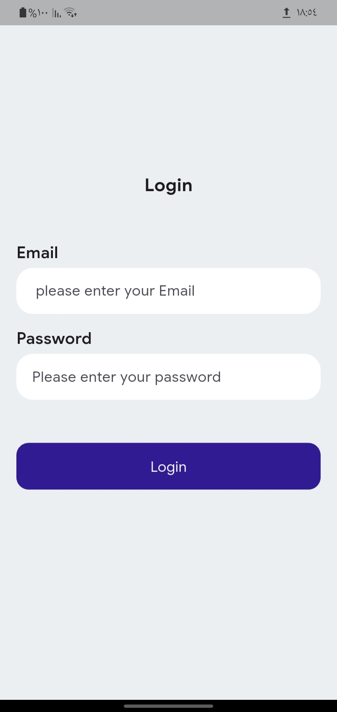
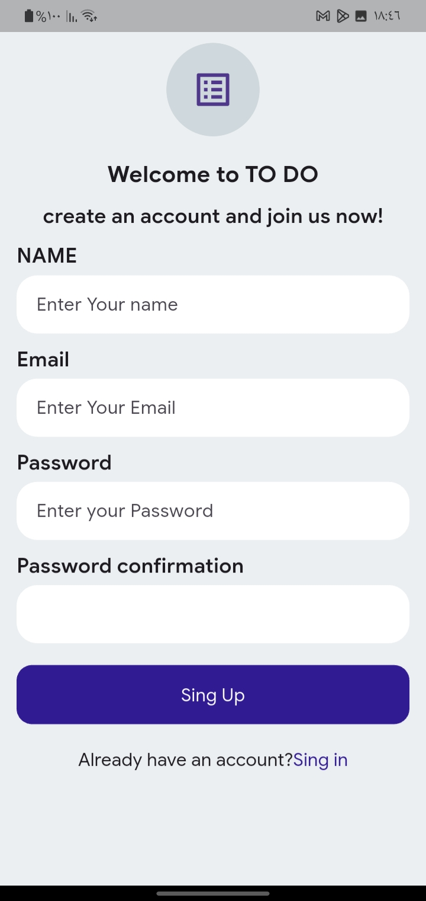
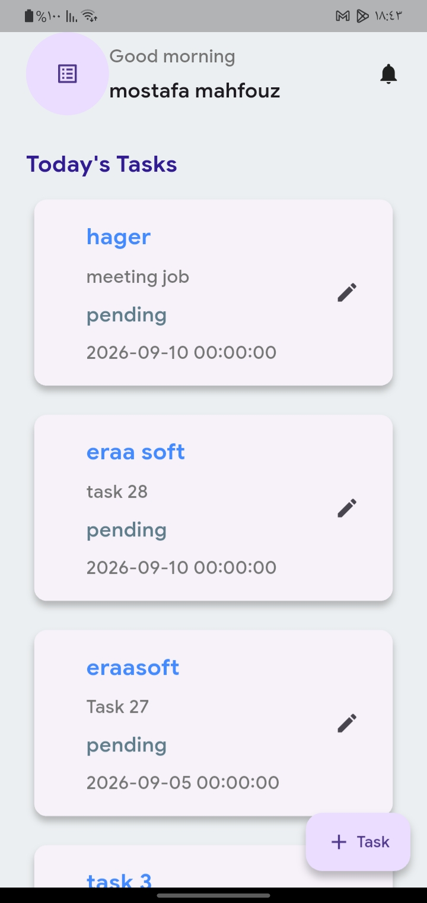
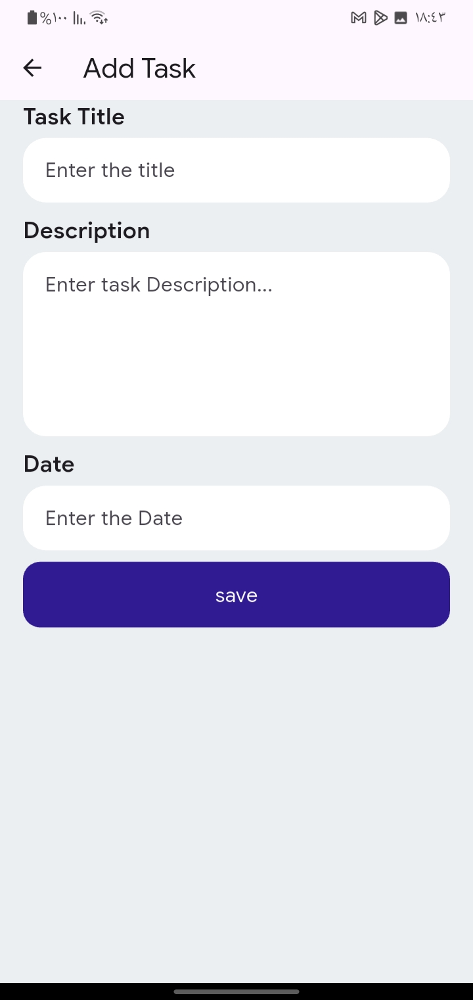
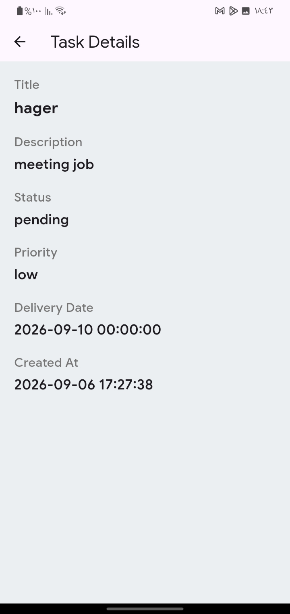
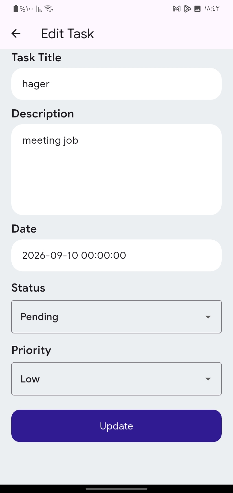
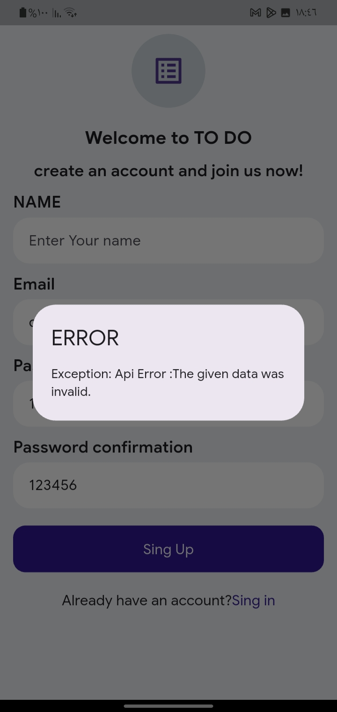

# To-Do app 
A flutter To-Do application that allows users to manage their tasks through REST ApI integration.

## Features
- user authentication (Login & Register)
- Add new tasks using REST API
- Update existing tasks
- Display task details
- Manage application state using cubit 
- Handle API and network errors

## Technologies
- Flutter
- Dart
- Dio
- Flutter Bloc / Cubit
- REST API
- Sharedpreferences
- Pretty Dio Logger

## Architecture
The project follows a feature-based architecture.

Each feature is divided into :
- Data layer: Model and Repository
- Presentation layer: UI and Cubit

The core layer contains shared components such as networking, routes, them, helpers and reusable widgets.

## API Integeration
The application communicates with a REST API using Dio.

API operations include:
- User authentication (Login & Regester)
- Adding new tasks
- Updating existing tasks
- Retrieving task details 

## Error Handling 
the application handles API and network errors and provides appropriate feedback to the user.

## Screenshots

| Login | Register |
|---|---|
|  |  |

| Home | Add Task |
|---|---|
|  |  |

| Task Details | Edit Task |
|---|---|
|  |  |

| Error Handling |
|---|
|  |